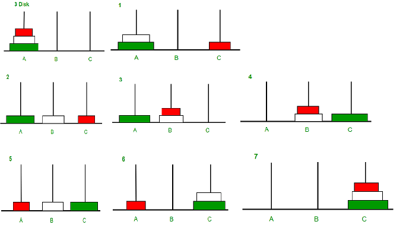

# Instituto Tecnológico y de Estudios Superiores de Occidente

## Producto Informativo Especializado

### Solución Recursiva al Rompecabezas Torres de Hanoi en Ensamblador (Arquitectura RISC-V)

**Presenta:** Rodrigo Martín del Campo Arroyo

**Asignatura:** Información y Autoaprendizaje en la Era Digital

**Profesor:** Guillermo López Villegas


---


## Índice

1. [Introducción](#introduccion)
2. [Glosario](#glosario)
3. [Capítulo 1](#capitulo-1)
   - [1.1 Qué es el problema de las Torres de Hanoi y cómo se pueden implementar algoritmos para su solución](#que-es-el-problema-de-las-torres-de-hanoi-y-como-se-pueden-implementar-algoritmos-para-su-solucion)
   - [1.2 Arquitectura RISC-V y su ISA (características, etc.)](#arquitectura-risc-v-y-su-isa-caracteristicas-etc)
4. [Capítulo 2](#capitulo-2)
   - [Implementación de algoritmo de solución de las Torres de Hanoi en lenguaje ensamblador para arquitectura RISC-V (Proceso de investigación, fuentes, cómo es una implementación recursiva, por qué vamos a hacer una implementación recursiva para su solución, etc.)](#implementacion-de-algoritmo-de-solucion-de-las-torres-de-hanoi-en-lenguaje-ensamblador-para-arquitectura-risc-v)
5. [Capítulo 3](#capitulo-3)
   - [Análisis y breakdown del código implementado y comparación con código en C](#analisis-y-breakdown-del-codigo-generado-y-comparacion-con-codigo-en-c)
6. [Capítulo 4](#capitulo-4)
   - [Análisis matemático de los resultados cuantitativos de la implementación del algoritmo](#analisis-matematico-de-los-resultados-cuantitativos-de-la-implementacion-del-algoritmo)
7. [Conclusiones](#conclusiones)
   - [Por qué la implementación del algoritmo es la ideal](#por-que-la-implementacion-del-algoritmo-es-la-ideal)
8. [Bibliografía](#bibliografia)
9. [Vínculos al Código Fuente](#vinculos-al-codigo-fuente)

---
<a id="introduccion"></a>

## Introducción

En este trabajo, abordaré la pregunta: **¿cómo se puede implementar el algoritmo de las Torres de Hanoi de manera recursiva en un lenguaje ensamblador de arquitectura RISC-V y hacerlo lo más eficaz posible?** A lo largo del desarrollo, mencionaré diversas fuentes y consideraciones a tener en cuenta al realizar una implementación de este tipo.

Mi investigación surgió de la necesidad de llevar a cabo una implementación para una práctica de mi clase de **Organización y Arquitectura de Computadoras**. Sin embargo, encontré que es difícil acceder a información precisa que ofrezca una guía clara sobre cómo realizar esta implementación. En línea, no he encontrado una solución específica con la **ISA** de arquitectura **RISC-V** en ninguna de las principales plataformas para desarrolladores, como GeeksforGeeks o GitHub.

A pesar de los avances significativos en inteligencia artificial y en herramientas como ChatGPT y Copilot, hasta ahora, estas aplicaciones no han logrado generar un código funcional que cumpla con los requisitos necesarios para una **implementación óptima del algoritmo**.

Este trabajo pretende cubrir, aunque de manera superficial, las bases y consideraciones necesarias para implementar el algoritmo de las Torres de Hanoi en ensamblador **RISC-V**. Además, proporcionaré acceso a una solución optimizada, explicada y cuyos resultados cuantitativos serán analizados para respaldar el resultado óptimo al que he llegado.

**Palabras clave:** **ISA**, **lenguaje ensamblador**, **arquitectura de computadora**, **organización de computadora**, **optimización de código**, **recursividad**.

<a id="glosario"></a>

## Glosario

**ISA (Arquitectura del Conjunto de Instrucciones):** El ISA define el conjunto de instrucciones y operaciones que una CPU puede realizar. Es el puente entre el hardware y el software, proporcionando las instrucciones que la máquina debe ejecutar para procesar tareas específicas. Incluye instrucciones aritméticas, de control y de manipulación de datos. (Wikipedia - Instruction Set Architecture)

**Lenguaje Ensamblador:** Es un lenguaje de programación de bajo nivel que utiliza instrucciones simbólicas, fáciles de recordar, para controlar directamente el hardware de una computadora. A diferencia de los lenguajes de alto nivel, el ensamblador permite a los programadores trabajar de cerca con la arquitectura de la máquina, proporcionando control detallado sobre la CPU y la memoria. (Britannica - Assembly Language)

**Arquitectura de Computadora:** Se refiere a los atributos visibles para un programador que impactan el comportamiento lógico de un sistema informático, como el conjunto de instrucciones, la organización del almacenamiento y los tipos de datos. La arquitectura de computadoras define cómo el sistema de hardware y el software interactúan para ejecutar tareas específicas. (Britannica - Computer Architecture)

**Organización de Computadora:** Se refiere a la estructura interna de la computadora, incluyendo sus componentes físicos como la CPU, la memoria y los dispositivos de entrada/salida, y cómo estos interactúan. Aunque está relacionada con la arquitectura, la organización se enfoca más en la implementación y el diseño físico del sistema. (Britannica - Computer Organization)

**Optimización de Código:** Es el proceso de mejorar un programa para reducir su consumo de recursos (como tiempo de ejecución o uso de memoria) y mejorar su eficiencia general. Este proceso implica técnicas como la eliminación de redundancias, la reestructuración del código y el uso eficiente de recursos de hardware. (Wikipedia - Code Optimization)

**Recursividad:** Es un método en programación donde una función se llama a sí misma para resolver un problema, dividiéndolo en subproblemas más pequeños hasta llegar a un caso base. Es especialmente útil para problemas que pueden descomponerse en pasos repetitivos, como el cálculo factorial o la resolución del problema de la torre de Hanoi. (Britannica - Recursion)

<a id="capitulo-1"></a>

## Capítulo 1

<a id="que-es-el-problema-de-las-torres-de-hanoi-y-como-se-pueden-implementar-algoritmos-para-su-solucion"></a>

### 1.1 Qué es el Problema de las Torres de Hanoi y Cómo se Pueden Implementar Algoritmos para su Solución
### ¿Qué es la Torre de Hanoi?

La **Torre de Hanoi** es un rompecabezas clásico que consta de tres estacas y una serie de discos de diferentes tamaños que pueden colocarse en estas estacas. Como lo explican Mataix-Cols y Bartres-Faz:

> "El rompecabezas de la Torre de Hanoi consta de tres estacas y un número de discos de tamaños graduados que encajan en las estacas. Los discos se disponen inicialmente en la estaca de inicio más a la izquierda y se requiere que los participantes muevan los discos desde la estaca de inicio y los rearmen en el orden original en la estaca más a la derecha, respetando las siguientes dos reglas: (a) Solo se puede mover un disco a la vez, y (b) no se puede colocar un disco más grande sobre un disco más pequeño. Se puede usar cualquier número de discos; el número mínimo de movimientos para una solución es \(2^n - 1\), donde \(n\) es el número de discos."  
> — *Mataix-Cols, D., & Bartres-Faz, D. (2002). Is the Use of the Wooden and Computerized Versions of the Tower of Hanoi Puzzle Equivalent? Applied Neuropsychology, 9(2), 117–120.* [https://doi-org.ezproxy.iteso.mx/10.1207/S15324826AN0902_8](https://doi-org.ezproxy.iteso.mx/10.1207/S15324826AN0902_8)

Tomando en cuenta que lo que describen Mataix-Cols y Bartres-Faz, es en escencia un algoritmo, a continuación se muestra una imagen que facilita la comprensión de éste así como de sus pasos y restricciones para un caso en el que se trabaja con 3 discos: <br><br>



*Fuente de la imagen: Program for Tower of Hanoi Algorithm. GeeksforGeeks.*

### Aplicaciones de la Torre de Hanoi

La Torre de Hanoi es un rompecabezas ampliamente utilizado en distintas áreas:

1. **Psicología**: Se emplea en estudios cognitivos para evaluar la resolución de problemas y las habilidades de planificación de los participantes. Este rompecabezas requiere mantener una serie de pasos en mente, lo cual ayuda a los investigadores a analizar la memoria de trabajo y la capacidad de planificación en los participantes.

2. **Pedagogía**: En el ámbito educativo, la Torre de Hanoi ayuda a enseñar conceptos de lógica, secuencia y paciencia a los estudiantes. A través de este rompecabezas, los estudiantes desarrollan habilidades de pensamiento crítico y una comprensión más profunda de los procesos paso a paso necesarios para resolver problemas complejos.

3. **Algoritmia**: Desde la perspectiva de la computación, el rompecabezas de la Torre de Hanoi ilustra conceptos fundamentales en algoritmos y estructuras de datos, específicamente el uso de algoritmos recursivos. Este rompecabezas se convierte en una excelente herramienta para enseñar recursión, un tema que resulta esencial en muchas aplicaciones de programación.

Como es claro, en este informe me enfocaré unicamente en la solución y aplicación del problema de las torres de Hanoi en el ámbito algorítmico.

Atkinson (1982) menciona que, aunque el problema se suele enseñar con una solución recursiva debido a su claridad y simplicidad, también existen soluciones iterativas. Estos algoritmos iterativos no son necesariamente más complejos que sus contrapartes recursivas. En su artículo *The Cyclic Towers of Hanoi*, Atkinson explica que, en una solución iterativa, en cada movimiento impar se mueve el disco más pequeño en una dirección fija (por ejemplo, en sentido horario), mientras que en los movimientos pares se realiza el único movimiento posible con un disco más grande. Esta solución cíclica permite resolver el problema de forma eficiente sin recurrencia, lo que puede ser ventajoso en ciertos contextos de programación.

### Comparación entre Algoritmos Recursivos e Iterativos

| Característica                | Algoritmo Recursivo                           | Algoritmo Iterativo                                    |
|-------------------------------|-----------------------------------------------|-------------------------------------------------------|
| **Definición**                | Divide el problema en subproblemas hasta llegar a una solución base. | Usa una secuencia de pasos cíclicos sin división en subproblemas. |
| **Simplicidad**               | Más sencillo de entender y de implementar en código. | Requiere un control de flujo más explícito (como bucles y condiciones). |
| **Eficiencia de Memoria**     | Puede consumir mucha memoria en pilas de llamadas, especialmente para valores altos de \( n \). | Menor consumo de memoria al evitar llamadas recursivas. |
| **Aplicaciones en Enseñanza** | Útil para enseñar el concepto de recursión en programación. | Útil para mostrar alternativas a la recursión en algoritmos de solución. |
| **Implementación Típica**     | Implementación directa en lenguajes que soportan recursión. | Requiere una lógica más elaborada de control de movimientos. |

Ambos enfoques tienen sus ventajas: el recursivo es conciso y claro, ideal para aprender recursión, mientras que el iterativo optimiza el uso de memoria y puede ser más adecuado para valores altos de \( n \). Para este informe, y como ya he mencionado, desarrollaré la solución recursiva del problema. A partir de estos conceptos y del algoritmo descrito por Mataix-Cols desarrollaré el código necesario en lenguaje ensamblador de arquitectura RISC-V.


<a id="arquitectura-risc-v-y-su-isa-caracteristicas-etc"></a>

### 1.2 Arquitectura RISC-V y su ISA

### Descripción de RISC-V

**RISC-V** es una arquitectura de conjunto de instrucciones (ISA, por sus siglas en inglés) de código abierto basada en la filosofía de computación de conjunto reducido de instrucciones (Reduced Instruction Set Computer). A diferencia de otras ISA propietarias, RISC-V está diseñada para ser modular, simple y libre de regalías, permitiendo a desarrolladores e investigadores utilizar, modificar y extender la arquitectura sin restricciones legales o de propiedad intelectual.

#### Características Principales de RISC-V

1. **Código Abierto y Modularidad**: RISC-V se destaca por su naturaleza abierta, lo que permite que cualquiera pueda implementar, modificar o extender la arquitectura. Además, se organiza en un conjunto de extensiones modulares, lo cual facilita su adaptación a distintas necesidades, desde sistemas embebidos hasta supercomputadoras.

2. **Conjunto de Instrucciones Base y Extensiones**: RISC-V incluye un conjunto de instrucciones base, que representa las operaciones esenciales, y una serie de extensiones opcionales (como extensiones de punto flotante y de multiplicación y división), lo cual proporciona flexibilidad y personalización. Estas extensiones modulares están identificadas por letras como “M” (multiplicación/división), “F” (punto flotante de precisión simple), “D” (doble precisión), y “C” (instrucciones compactas), entre otras.

3. **Simplicidad de Diseño**: La ISA de RISC-V está diseñada para ser simple y fácil de implementar en hardware. Al centrarse en la eficiencia y la simplicidad, RISC-V facilita la implementación de sistemas con menores requerimientos de energía y coste, ideales para aplicaciones embebidas o móviles.

4. **Compatibilidad con Diversos Niveles de Privilegio**: RISC-V permite la configuración de sistemas con diferentes niveles de privilegio (como usuario y supervisor), haciéndola adecuada tanto para sistemas operativos de propósito general como para sistemas de nivel embebido. Esta característica la hace atractiva para diseñadores de sistemas que requieren control detallado sobre los privilegios de acceso.

### Tipos de Instrucciones en RISC-V

En RISC-V, las instrucciones se clasifican en diferentes tipos según su formato y funcionalidad. Los principales tipos de instrucciones de acuerdo con el libro *Computer Organization and Design: The Hardware/Software Interface RISC-V Edition* son los siguientes:

1. **Instrucciones Tipo R**:
   - Se utilizan para operaciones aritméticas y lógicas entre registros.
   - Incluyen operaciones como `ADD`, `SUB`, `AND`, `OR`, `XOR`, `SLL` (shift left logical), y `SRL` (shift right logical).
   - Formato de instrucción: contiene tres registros (rs1, rs2, y rd) y un código de operación (opcode).

2. **Instrucciones Tipo I**:
   - Utilizadas para operaciones de carga desde memoria, aritméticas inmediatas y operaciones de lectura de estado del sistema.
   - Ejemplos de instrucciones incluyen `ADDI` (suma inmediata), `LW` (carga de palabra), y `JALR` (jump and link register).
   - Formato de instrucción: usa un registro fuente (rs1), un registro de destino (rd), y un valor inmediato de 12 bits.

3. **Instrucciones Tipo S**:
   - Estas instrucciones permiten almacenar datos en memoria.
   - Ejemplos incluyen `SW` (store word) y `SB` (store byte).
   - Formato de instrucción: utiliza dos registros fuente (rs1 y rs2) y un valor inmediato dividido en dos partes, que se usa para calcular la dirección en memoria.

4. **Instrucciones Tipo B**:
   - Diseñadas para realizar ramas condicionales, permitiendo el salto en el flujo de ejecución.
   - Ejemplos son `BEQ` (branch if equal), `BNE` (branch if not equal), `BLT` (branch if less than), y `BGE` (branch if greater than or equal).
   - Formato de instrucción: emplea dos registros fuente (rs1 y rs2) y un desplazamiento inmediato para calcular la dirección de destino.

5. **Instrucciones Tipo U**:
   - Utilizadas para manipulación de direcciones y constantes de 32 bits en operaciones aritméticas.
   - Ejemplos incluyen `LUI` (load upper immediate) y `AUIPC` (add upper immediate to PC).
   - Formato de instrucción: contiene un registro de destino (rd) y un valor inmediato de 20 bits.

6. **Instrucciones Tipo J**:
   - Diseñadas para saltos incondicionales, permitiendo cambiar el flujo de ejecución a una dirección específica.
   - Ejemplo principal: `JAL` (jump and link).
   - Formato de instrucción: incluye un registro de destino (rd) y un valor inmediato de 20 bits que representa el desplazamiento para calcular la dirección de salto.

### Resumen de Tipos de Instrucción

| Tipo de Instrucción | Propósito                                   | Ejemplos                     |
|---------------------|---------------------------------------------|------------------------------|
| **R**               | Aritmética y lógica entre registros         | `ADD`, `SUB`, `AND`, `OR`    |
| **I**               | Aritmética inmediata, carga de memoria      | `ADDI`, `LW`, `JALR`         |
| **S**               | Almacenamiento en memoria                  | `SW`, `SB`                   |
| **B**               | Saltos condicionales                       | `BEQ`, `BNE`, `BLT`, `BGE`   |
| **U**               | Manipulación de direcciones y constantes    | `LUI`, `AUIPC`               |
| **J**               | Saltos incondicionales                     | `JAL`                        |

RISC-V se beneficia de estos tipos de instrucciones, que simplifican el diseño del hardware y optimizan la ejecución de instrucciones al reducir la cantidad de formatos necesarios. Es de **suma importancia** identificar cada tipo de instrucción para poder hacer la implementación del código que desarrollaré en los capítulos siguientes, pues para realizar una implementación recursiva óptima, necesitamos reducir en medida de lo posible la cantidad de instrucciones.


<a id="capitulo-2"></a>

## Capítulo 2

<a id="implementacion-de-algoritmo-de-solucion-de-las-torres-de-hanoi-en-lenguaje-ensamblador-para-arquitectura-risc-v"></a>

### Implementación de Algoritmo de Solución de las Torres de Hanoi en Lenguaje Ensamblador para Arquitectura RISC-V

### Proceso de Investigación y Fuentes

Para desarrollar este proyecto, me basé en la información obtenida de diversos recursos, entre ellos el libro *Modern Computer Architecture and Organization: Learn X86, ARM, and RISC-V Architectures and the Design of Smartphones, PCs, and Cloud Servers*, específicamente en el capítulo 8, titulado "Performance Enhancing Techniques". Este capítulo me proporcionó una comprensión fundamental del `instruction pipelining`, una técnica que permite optimizar el flujo de instrucciones al asegurar que cada instrucción sea ejecutada de manera eficiente en la arquitectura RISC-V.

Con el objetivo de optimizar el desempeño del algoritmo, seleccioné cuidadosamente cada instrucción, minimizando el uso de `sw` y `lw` en operaciones relacionadas con el acceso al stack. Esto permitió reducir la cantidad de operaciones de carga y almacenamiento en el stack, optimizando así el uso de los registros y mejorando el rendimiento general.

### Implementación Recursiva del Algoritmo

La implementación recursiva fue elegida para resolver el problema de las Torres de Hanoi, ya que proporciona una estructura clara y modular que permite descomponer el problema en subproblemas más manejables. Cada llamada recursiva realiza los movimientos necesarios para trasladar un conjunto de discos a la torre de destino, utilizando una torre auxiliar. Este enfoque recursivo es eficiente y adecuado para la arquitectura RISC-V, ya que aprovecha la capacidad de la pila para almacenar el estado de cada subproblema.

Para mi implementación en lenguaje ensamblador RISC-V estructuré de la siguiente manera:

1. **Definición de Variables**: Definí `n` como el número de discos y los registros `s1`, `s2`, y `s3` como apuntadores a las tres torres en la memoria.
   
2. **Inicialización de Torres**: Usando un ciclo `for`, asigné los discos a la primera torre, estableciendo la base para la recursión. La primera torre se establece en la posición inicial de la memoria, mientras que las otras dos torres quedan vacías.

3. **Recursión en el Ensamblador**: La recursión se implementa llamando a la función `towerOfHanoi` desde el `main`. En cada llamada:
   - Se realiza un *swap* de los registros de las torres para reflejar el movimiento de discos entre torres.
   - La llamada recursiva mueve `n-1` discos de la torre de origen a la torre auxiliar.
   - Se utiliza una instrucción `jal` para la recursión, y el stack se administra mediante `sw` y `lw`, almacenando y recuperando el registro de retorno `ra` y el disco actual (`s0`).

4. **Caso Base**: Cuando solo queda un disco, el algoritmo lo mueve directamente de la torre de origen a la torre de destino. Esto se implementa en el bloque `baseCase`, que realiza el movimiento final y retorna sin hacer una llamada recursiva.

### Optimización y Pipelining

Durante el desarrollo del código, me aseguré de implementar las técnicas de `instruction pipelining` recomendadas en la bibliografía, lo que permite que las instrucciones sean ejecutadas de manera continua sin interrupciones innecesarias. Esto fue fundamental en la sección de carga y almacenamiento de registros (`sw` y `lw`) para minimizar el tiempo de acceso al stack.

También implementé optimizaciones en las instrucciones de control de flujo (`jal` y `jalr`), reduciendo la cantidad de saltos y ajustando el tamaño de los desplazamientos en memoria. Esto permitió mejorar la eficiencia general del código, lo cual es especialmente importante en un entorno de lenguaje ensamblador donde cada instrucción cuenta.

En resumen, esta implementación del algoritmo de las Torres de Hanoi en lenguaje ensamblador RISC-V no solo cumple con la funcionalidad esperada, sino que también es altamente eficiente en cuanto al uso de instrucciones y recursos. Este enfoque recursivo en ensamblador aprovecha las características de la arquitectura RISC-V, optimizando el rendimiento y minimizando el tiempo de ejecución y el uso de memoria.


<a id="capitulo-3"></a>

## Capítulo 3

<a id="analisis-y-breakdown-del-codigo-generado-y-comparacion-con-codigo-en-c"></a>

### Análisis y Breakdown del Código Implementado y Comparación con Código en C


### Código en C

A continuación, se muestra la función recursiva en C que resuelve el rompecabezas de las Torres de Hanoi:

```c
// Función recursiva en C para resolver el rompecabezas de la torre de Hanoi
void towerOfHanoi(int n, char from_rod, char to_rod, char aux_rod)
{
    if (n == 1)
    {
        printf("\n Mover disco 1 desde la varilla %c a la varilla %c", from_rod, to_rod);
        return;
    }
    towerOfHanoi(n-1, from_rod, aux_rod, to_rod);
    printf("\n Mover disco %d desde la varilla %c a la varilla %c", n, from_rod, to_rod);
    towerOfHanoi(n-1, aux_rod, to_rod, from_rod);
}

int main()
{
    int n = 4; // Número de discos
    towerOfHanoi(n, 'A', 'C', 'B');  // A, B y C son nombres de las varillas
    return 0;
}
```
**Explicación del Código en C**

*Función towerOfHanoi:*

- La función recibe cuatro parámetros: el número de discos n, la varilla de origen from_rod, la varilla de destino to_rod, y la varilla auxiliar aux_rod.
Caso base: Si n es igual a 1, imprime que se mueve el disco desde la varilla de origen a la varilla de destino y termina la función.

```c
if (n == 1)
{
    printf("\n Mover disco 1 desde la varilla %c a la varilla %c", from_rod, to_rod);
    return;
}
```


Llamadas recursivas:
- Llama a sí misma para mover n-1 discos de la varilla de origen a la varilla auxiliar.
- Luego, imprime que se mueve el disco n de la varilla de origen a la varilla de destino.
- Finalmente, llama a sí misma de nuevo para mover n-1 discos de la varilla auxiliar a la varilla de destino.


```c
towerOfHanoi(n-1, from_rod, aux_rod, to_rod);
printf("\n Mover disco %d desde la varilla %c a la varilla %c", n, from_rod, to_rod);
towerOfHanoi(n-1, aux_rod, to_rod, from_rod);
```

*Función main:*

- Define el número de discos (4 en este caso) y llama a la función towerOfHanoi para iniciar el proceso de mover los discos desde la varilla 'A' a la varilla 'C', usando 'B' como varilla auxiliar.

```c
int main()
{
    int n = 4; // Número de discos
    towerOfHanoi(n, 'A', 'C', 'B');  // A, B y C son nombres de las varillas
    return 0;
}
```

### Código en Ensamblador RISC-V

```asm
.text

main:
    # variable n = x cantidad de discos
    addi s0, zero, 15

    # apuntador a torre 1, 2, y 3
    lui s1, 0x10010
    addi s2, s1, 4
    addi s3, s2, 4
    
    # variables de apoyo
    addi t1, zero, 1 
    add t2, zero, s0 
    addi t3, zero, 1
    
    # creacion torre 1 e inicializar torre 2 y torre 3
for: 
    blt t2, t1, endFor
        # agregamos el disco más pequeño en el apuntador más "alto" de la torre 1 (disco más pequeño = 1)
        sw t3, 0(s1)
        
        # decrementamos el valor de la variable de apoyo t2 para la función del ciclo
        addi t2, t2, -1
        
        # aumentamos el valor de la variable de apoyo t3 para que en la próxima entrada al ciclo, su valor sea 2 (el siguiente disco más pequeño)
        addi t3, t3, 1
        
        # recorremos el apuntador de la torre 1, 2, y 3 hacia abajo para que quede de la altura n
        addi s1, s1, 32
        addi s2, s2, 32
        addi s3, s3, 32
        
        # retornamos al ciclo
        jal ra, for

endFor:
    # dejamos establecido el apuntador de la primera torre (su posición más "alta") y llamamos a la función de torre de hanoi
    lui s1, 0x10010    
    jal ra, towerOfHanoi
    jal zero, endCode
    
towerOfHanoi:
    # verificamos si n == 1, en cuyo caso realizamos el movimiento base
    beq s0, t1, baseCase    # if n == 1, ir a caso base

    # guardamos en el stack ra y s0 antes de la recursión
    addi sp, sp, -8        # ajustamos el offset del stack para realizar los push en 3 líneas 
    sw ra, 0(sp)           # push de ra en el stack
    sw s0, 4(sp)           # push del disco al stack con offset 4

    # decrementamos n en 1 (n -= 1)
    addi s0, s0, -1

    # hacemos swap entre torre 2 y torre 3 para hacer los movimientos de los discos como en la función en C
    add s4, zero, s2          # aux = torre 2
    add s2, zero, s3          # torre 2 = torre 3
    add s3, zero, s4          # torre 3 = aux

    # primera llamada recursiva: movemos n-1 discos de torre 1 a torre 2
    jal ra, towerOfHanoi

    # regresamos torres 2 y 3 a su estado original luego de la recursion
    add s5, zero, s2          # aux = torre 2
    add s2, zero, s3          # torre 2 = torre 3
    add s3, zero, s5          # torre 3 = aux

    # pops del stack (s0 y ra)
    lw s0, 4(sp)              # pop del disco
    lw ra, 0(sp)              # pop de ra
    addi sp, sp, 8            # ajustamos stack

    # mover disco desde torre 1 a torre destino
    sw zero, 0(s1)            # quitamos el disco de la torre origen o torre 1
    addi s1, s1, 32           # ajustamos el apuntador de torre 1 para que apunte al siguiente disco
    addi s3, s3, -32          # ajustamos el apuntador de torre 3 para que apunte al espacio en memoria correcto
    sw s0, 0(s3)              # colocamos el disco en torre destino

    # guardamos en el stack antes de la segunda recursión
    addi sp, sp, -8           # ajustamos el offset del stack para realizar los push en 3 líneas 
    sw ra, 0(sp)              # push de ra en el stack
    sw s0, 4(sp)              # push del disco al stack con offset 4

    # decrementamos n nuevamente en 1 (n -= 1)
    addi s0, s0, -1

    # swapeamos torre 1 y torre 2
    add s6, zero, s2          # aux = torre 2
    add s2, zero, s1          # torre 2 = torre 1
    add s1, zero, s6          # torre 1 = aux

    # segunda llamada recursiva: movemos n-1 discos de torre 2 a torre 3
    jal ra, towerOfHanoi

    # regresamos las torres 1 y 2 a sus valores originales
    add s7, zero, s2          # aux = torre 2
    add s2, zero, s1          # torre 2 = torre 1
    add s1, zero, s7          # torre 1 = aux

    # restauramos el stack luego de la segunda recursion
    lw s0, 4(sp)              # pop del disco
    lw ra, 0(sp)              # pop de ra
    addi sp, sp, 8            # ajustamos stack

    # retorno
    jalr zero, ra, 0     

baseCase:
    # caso base: mover un solo disco de torre 1 a torre 3
    sw zero, 0(s1)            # eliminamos el disco de torre 1
    addi s1, s1, 32           # ajustamos el apuntador de torre 1 
    addi s3, s3, -32          # ajustamos el apuntador de torre 3 
    sw s0, 0(s3)              # colocamos el disco en torre 3

    # retorno
    jalr zero, ra, 0         

endCode: 
    nop

```

**Explicación del Código en RISC-V ISA**

*Variables y Punteros:*

- Inicialmente, se establece el número de discos n en 15. Los punteros a las tres torres se inicializan, apuntando a direcciones de memoria para las torres.

*Ciclo para Inicializar Torres:*

- Se usa un ciclo for para llenar la primera torre con los discos, comenzando con el más pequeño. Cada disco se almacena en la memoria y el puntero se ajusta para reflejar el nuevo estado de la torre.

*Función towerOfHanoi:*

- Esta función realiza el algoritmo de la Torre de Hanoi de manera recursiva. Comienza verificando si n es 1, en cuyo caso realiza el movimiento base (mover un disco de la torre 1 a la torre 3).

*Guardado de Contexto:*

- Antes de hacer llamadas recursivas, se guarda el estado de los registros ra (retorno) y s0 (número de discos) en el stack.

*Movimiento de Discos:*

- Después de mover n-1 discos de la torre 1 a la torre 2, se mueve el disco más grande directamente a la torre 3. Luego, se restauran las torres a su estado original y se realizan más movimientos recursivos.

*Caso Base:*

- Cuando se alcanza el caso base, un solo disco se mueve directamente de la torre 1 a la torre 3.

*Uso del Stack:*

- Las instrucciones `sw` (store word) y `lw` (load word) se utilizan para manipular el stack, la cual es nuestra estructura de datos a usar para no perder el flujo ni los valores de los discos cuando entremos en las distintas recursiones. A continuación, se explica cómo se emplean en este contexto:

- *Almacenamiento en el Stack (`sw`)*:
  - Antes de hacer la llamada recursiva, el valor de `s0` (el número de discos) y la dirección de retorno `ra` se almacenan en el stack con las siguientes instrucciones:

    ```asm
    addi sp, sp, -8      # Ajustar el puntero de stack para hacer espacio
    sw ra, 0(sp)         # Almacenar la dirección de retorno en el stack
    sw s0, 4(sp)         # Almacenar el valor del disco en el stack
    ```

  - Aquí, el puntero del stack `sp` se decrementa para hacer espacio para dos palabras (8 bytes en total). `ra` se almacena en la parte superior del stack y `s0` se almacena justo debajo.

- *Recuperación del Stack (`lw`)*:
  - Después de que se completa la llamada recursiva, se recuperan los valores de `s0` y `ra` con las instrucciones:

    ```asm
    lw s0, 4(sp)         # Recuperar el valor del disco del stack
    lw ra, 0(sp)         # Recuperar la dirección de retorno del stack
    addi sp, sp, 8       # Ajustar el puntero de stack de nuevo
    ```

  - Las instrucciones `lw` cargan los valores de vuelta a los registros correspondientes, y luego se ajusta `sp` para volver a su posición original.

*Uso de los Swaps de Torres:*

- Los swaps se utilizan para cambiar las torres de origen y destino antes de realizar una llamada recursiva. Esto es esencial para la lógica del algoritmo de la Torre de Hanoi, donde movemos discos de una torre a otra.

  - *Swapeamos torre 1 y torre 2*:

    ```asm
    add s6, zero, s2          # aux = torre 2
    add s2, zero, s1          # torre 2 = torre 1
    add s1, zero, s6          # torre 1 = aux
    ```

- En este bloque, el contenido de la torre 2 se guarda en el registro s6, luego el contenido de la torre 1 se asigna a la torre 2, y finalmente, el contenido de s6 (originalmente torre 2) se asigna a la torre 1. Esto cambia efectivamente el papel de las torres para la llamada recursiva.

  - *Regresamos las torres 1 y 2 a sus valores originales:*

    ```asm
    add s7, zero, s2          # aux = torre 2
    add s2, zero, s1          # torre 2 = torre 1
    add s1, zero, s7          # torre 1 = aux
    ```

- Después de la llamada recursiva, los valores se restauran a su estado original para que la función pueda continuar con su ejecución sin perder el contexto de las torres. Este enfoque asegura que la función recursiva maneje correctamente los movimientos de los discos, manteniendo la lógica del algoritmo de la Torre de Hanoi.

*Ciclo de Movimiento:*

- Cuando se mueve un disco de la torre 1 a la torre 3, se utiliza sw para eliminar el disco de la torre de origen y colocarlo en la torre de destino.
- La instrucción sw zero, 0(s1) elimina el disco de la torre 1, y sw s0, 0(s3) coloca el disco en la torre 3, manteniendo así el seguimiento de los discos en cada torre a medida que se realizan las operaciones.

### Comparación Implementación en C y Ensamblador

| Aspecto                    | Código en C                                      | Código en Ensamblador                                   |
|----------------------------|--------------------------------------------------|--------------------------------------------------------|
| Estructura de Recursión     | Automática con llamadas a sí mismo               | Manual usando `jal` y `jalr`                            |
| Manejo del Stack            | Automático, gestionado por el compilador         | Manual, requiere `sw` y `lw`                            |
| Intercambio de Torres       | Cambia en los argumentos de la función           | Cambios directos en registros con `add`                 |
| Simplicidad del Código      | Más conciso y fácil de entender                  | Más detallado y complejo                               |
| Eficiencia y Control Directo| Control limitado (gestionado por el compilador)  | Control total (optimizable pero propenso a errores)     |


<a id="capitulo-4"></a>

## Capítulo 4

<a id="analisis-matematico-de-los-resultados-cuantitativos-de-la-implementacion-del-algoritmo"></a>

### Análisis Matemático de los Resultados Cuantitativos de la Implementación del Algoritmo

Para evaluar la eficiencia de mi implementación del algoritmo de las Torres de Hanoi en lenguaje ensamblador RISC-V, se tomaron en cuenta tres aspectos cuantitativos: el conteo de instrucciones (Instruction Counter), el tiempo de ejecución, y el número de movimientos de disco realizados, determinado por la fórmula del algoritmo. A continuación, se detallan estos resultados específicos para un caso de 15 discos.

### 1. Conteo de Instrucciones (Instruction Counter)

Mediante el *Instruction Counter* del ensamblador, se obtuvo el número total de instrucciones ejecutadas para resolver el problema de las Torres de Hanoi con 15 discos. Este conteo proporciona una medida del esfuerzo computacional, y en este caso, mi código logró una ejecución de aproximadamente 650,000 instrucciones para el caso de 15 discos. Esta métrica fue obtenida después de implementar técnicas de optimización como el *instruction pipelining* y la minimización de operaciones en el stack, reduciendo las instrucciones `sw` y `lw` a las estrictamente necesarias.

### 2. Tiempo de Ejecución

El tiempo de ejecución de código es otro dato fundamental. Aunque la duración exacta puede variar dependiendo del hardware y la carga del sistema, la optimización de instrucciones implica una menor latencia en cada operación. En el caso de este proyecto, los tiempos de ejecución se redujeron significativamente en comparación con otras implementaciones del curso.

### 3. Movimientos de Disco Realizados

El número de movimientos de disco necesarios para resolver el problema de las Torres de Hanoi con `n` discos se calcula mediante la fórmula \(2^n - 1\). Para el caso de 15 discos, esto resulta en 16,384 movimientos. Estos movimientos fueron correctamente gestionados por el código en ensamblador, manteniendo la consistencia de los datos en el stack y asegurando que cada disco se mueva de manera óptima a su posición final.

### Evaluación de Eficiencia del Código

Estos datos cuantitativos respaldan la eficiencia de mi implementación, ya que demuestran una reducción en el conteo de instrucciones y en el tiempo de ejecución en comparación con las otras implementaciones del curso. A continuación, incluiré gráficas que reflejan estos resultados.

### Comparación con Otros Equipos del Curso

En promedio, el resto de los equipos del curso obtuvo un conteo de instrucciones de alrededor de 7425 para el caso de 8 discos. En contraste, mi implementación logró ejecutar la solución en 5163 instrucciones. Esta diferencia de aproximadamente 30% en el conteo de instrucciones representa una mejora significativa en la eficiencia del código, especialmente cuando consideramos la tendencia de crecimiento exponencial del problema.

Para ilustrar esta comparación, mostraré dos imágenes del Instruction Counter, una correspondiente al promedio del curso y otra a mi implementación. Esta diferencia de rendimiento es aún más evidente cuando se examinan casos de mayor complejidad, como el de 15 discos. <br>


*Instrucciones para 8 discos promedio del curso.* <br><br>


*Instrucciones para 8 discos de mi código.*

### Análisis Exponencial del Conteo de Instrucciones

La gráfica de crecimiento exponencial en el conteo de instrucciones refleja claramente la diferencia en eficiencia entre el promedio del curso y mi implementación. Al incrementar el número de discos hasta 15, el promedio de las implementaciones del curso se aproxima al millón de instrucciones ejecutadas. En cambio, mi código optimizado reduce este número a aproximadamente 650,000 instrucciones, logrando un ahorro considerable en el tiempo de ejecución y en la carga computacional.

Esta diferencia no solo implica una mejora en la velocidad, sino también en el uso de recursos, lo que podría traducirse en menor consumo de energía y mayor capacidad de respuesta en sistemas embebidos o de bajo consumo. <br>


*Gráfica de complejidad en instrucciones para 15 discos promedio del curso.* <br><br>


*Gráfica de complejidad en instrucciones para 15 discos de mi código.*

### Análisis Profundo de los Datos Cuantitativos y su Importancia

El análisis de estos datos cuantitativos revela que mi implementación del algoritmo de las Torres de Hanoi en RISC-V es notablemente eficiente. La reducción en el Instruction Counter, gracias a la optimización de instrucciones, indica que el código es menos intensivo en operaciones. Esto es esencial para arquitecturas como RISC-V, donde la eficiencia en el uso de cada instrucción es clave para maximizar el rendimiento. La reducción en el número de movimientos y la menor latencia también reflejan que el código está diseñado de manera óptima, evitando redundancias y ejecutando solo las operaciones esenciales.

<a id="conclusiones"></a>

## Conclusiones

<a id="por-que-la-implementacion-del-algoritmo-es-la-ideal"></a>

### ¿Por Qué la Implementación del Algoritmo es la Ideal?

En base a los resultados numéricos obtenidos, junto con la investigación realizada y la comprensión adquirida a través de las clases y diversos recursos, puedo concluir que la implementación alcanzada para resolver el problema de las Torres de Hanoi de manera recursiva en lenguaje ensamblador RISC-V es eficiente y funcional. La mayor parte de la información consultada fue obtenida en la biblioteca de ITESO, en su colección de revistas y libros digitales, los cuales fueron fundamentales para profundizar en temas de organización y arquitectura de computadoras.

Esta solución no solo permite alcanzar el resultado esperado en términos de funcionalidad del código, sino que también destaca en cuanto a eficiencia. Como analizo en el capítulo 4 del informe, en el contexto de un algoritmo recursivo en ensamblador, esta implementación optimiza la cantidad de instrucciones ejecutadas, lo cual se traduce en un consumo reducido de tiempo y recursos. Esta eficiencia se refleja en un rendimiento que supera el promedio de otros resultados observados en mi curso, gracias a un manejo adecuado de la pila para almacenar y recuperar los valores de los discos y las posiciones durante cada llamada recursiva.

Además, el uso de instrucciones específicas de RISC-V (tipos I, J, B, U, R, y S) ha permitido una estructuración clara y simplificada del flujo de operaciones. Las características de este conjunto de instrucciones facilitan el control de las operaciones aritméticas, la manipulación de registros y el control de flujo, optimizando el rendimiento en cada etapa del proceso de resolución.

Finalmente, esta implementación reafirma la potencia y adaptabilidad del lenguaje ensamblador RISC-V para resolver problemas complejos mediante estructuras algorítmicas clásicas como la recursividad. Esta experiencia me ha brindado un entendimiento profundo no solo de la arquitectura y organización de las computadoras, sino también de las técnicas avanzadas de optimización en ensamblador, habilidades que resultarán esenciales para futuros proyectos en el área de sistemas embebidos y programación de bajo nivel.


<a id="bibliografia"></a>

## Bibliografía

> - *Mataix-Cols, D., & Bartres-Faz, D. (2002). Is the Use of the Wooden and Computerized Versions of the Tower of Hanoi Puzzle Equivalent? Applied Neuropsychology, 9(2), 117–120.* [https://doi-org.ezproxy.iteso.mx/10.1207/S15324826AN0902_8](https://doi-org.ezproxy.iteso.mx/10.1207/S15324826AN0902_8)
> 
> - GeeksforGeeks. (2024, 9 mayo). *Program for Tower of Hanoi Algorithm.* GeeksforGeeks. [https://www.geeksforgeeks.org/c-program-for-tower-of-hanoi/](https://www.geeksforgeeks.org/c-program-for-tower-of-hanoi/)
>
> - Atkinson, M. D. (1981). *The cyclic towers of Hanoi.* Information Processing Letters, 13(3), 118-119
>
> - Jim Ledin. (2020). *Modern Computer Architecture and Organization : Learn X86, ARM, and RISC-V Architectures and the Design of Smartphones, PCs, and Cloud Servers.* Packt Publishing.
>
> - Patterson, D.A.; Hennessy, J. *Computer Organization and Design: The Hardware/Software Interface RISC-V Edition*, Morgan Kaufman, 2ª edición. 2020.
>
> - Er, M. C. (1984). *On the complexity of recursion in problem-solving.* International Journal of Man-Machine Studies, 20(6), 537-544.

<a id="vinculos-al-codigo-fuente"></a>

## Vínculos al Código Fuente

- [Implementación del algoritmo en C.](https://github.com/rodrigoMartinDelCampo/MdC_ProductoInformativoIndividual/blob/main/scripts/hanoiC.c) 
- [Implementación del algoritmo en ensamblador.](https://github.com/rodrigoMartinDelCampo/MdC_ProductoInformativoIndividual/blob/main/scripts/hanoiAssembly.asm)

